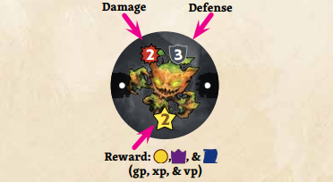
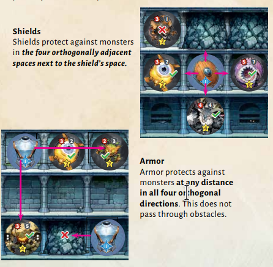

# ⚔️ 3 - COMBATIR CONTRA MONSTRUOS 🛡️

Primero recibe el daño de los monstruos y, a continuación, comprueba si los has derrotado para conseguir sus recompensas.

Los monstruos atacan a los jugadores y se pueden derrotar para conseguir Oro, EXP y PV. Todos los monstruos funcionan de la misma manera, independientemente de su tipo. Para derrotar a un monstruo, los jugadores deben golpearlo con armas siguiendo el patrón de ataque de cada arma.

---

## 💥 3A - ATAQUE DE LOS MONSTRUOS 🩸

Determina el daño de cada monstruo en tu mazmorra, reducido por la fuerza de las fichas de defensa pertinentes. Pierde 1 de salud por cada punto de daño. Si tu salud baja a cero o menos, consulta la sección «Morir» (página 15).

* **🛡️ Fichas de Defensa:** Las fichas de defensa reducen el daño de los monstruos en una cantidad igual a su fuerza. Una sola ficha de defensa puede protegerte de varios monstruos.

### 🛡️ Escudos y Armadura

* **Escudos:** Los escudos protegen contra los monstruos situados en las cuatro casillas ortogonalmente adyacentes a la casilla del escudo.

* **Armadura:** La armadura protege contra los monstruos a cualquier distancia en las cuatro direcciones ortogonales. Esto no atraviesa obstáculos.

---

## 💀 MORIR 🪦

Cuando alcanzas cero de salud, tu héroe muere. Continúas resolviendo la mazmorra, pero con estas diferencias:

* 🚫 No puedes ganar salud; ignora cualquier efecto de curación.

* 📉 Cada vez que fueras a perder salud por debajo de cero, en su lugar pierdes 1 PV.

* ⚖️ En cada paso restante de la fase de resolución, divide a la mitad el total de PV que ganarías (redondeando hacia abajo).

> **Ejemplo:** Nyx tiene 5 de salud y recibe 9 de daño de los monstruos. Su salud baja a $0$. Debería perder 4 puntos de salud adicionales, por lo que en su lugar pierde 4 PV.

---

## 🖼️ Ilustraciones de Referencia

  
  

