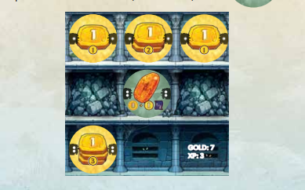
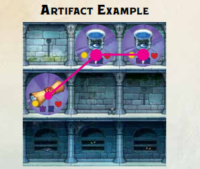

# 🪙 4 - MONEDAS 💰

Gana oro igual a la fuerza total de todas las monedas en tu mazmorra.

Las fichas de moneda proporcionan oro obtenido de la reserva, sin importar dónde estén colocadas en tu mazmorra (siempre y cuando estén en tu planta actual o por encima de ella).

---

# 💎 5 - GEMAS 🔮

Gana recompensas por las monedas que estén adyacentes a tus gemas.

Las fichas de gema otorgan recompensas según la fuerza de todas las fichas de moneda ubicadas en las 8 casillas que las rodean.

* **Jade 🟢**
  Otorgas oro igual a la fuerza de las monedas en las casillas circundantes.
* **Ámbar 🟠**
  Otorgas oro igual a la fuerza de las monedas en las casillas circundantes y EXP igual a la mitad de esa cantidad (redondeando hacia abajo).
* **Diamante 💎**
  Otorgas oro igual a la fuerza de las monedas en las casillas circundantes, y PV igual a la mitad de esa cantidad (redondeando hacia abajo).

---

# 📜 6 - ARTEFACTOS 🏛️

Gana una variedad de recompensas por cada grupo de artefactos adyacentes.

A diferencia de otros pasos, los jugadores se turnan para resolver las recompensas de sus artefactos, empezando por el jugador con más PV y avanzando hacia el que tenga menos (los empates se resuelven en el sentido de las agujas del reloj a partir del jugador inicial).

Los artefactos que están conectados (adyacentes diagonal u ortogonalmente) forman un grupo. No puedes tratar los artefactos conectados como varios grupos.

Cada grupo tiene dos características importantes: **tamaño** y **poder**. Valora cada grupo por separado siguiendo estos pasos:

1. **Elige recompensas:** Por cada tipo diferente de artefacto en el grupo, elige una recompensa: EXP, PV, salud u oro. No puedes elegir la misma recompensa dos veces.
2. **Obtén las recompensas:** Gana una cantidad de cada recompensa elegida igual al tamaño del grupo (el número total de todos los artefactos conectados en el grupo).

## 📊 EJEMPLO DE ARTEFACTOS

> Nyx tiene un grupo de 3 artefactos: 1 pergamino y 2 cálices. Hay dos tipos de artefacto, por lo que elige dos recompensas: EXP y PV. Luego gana 3 de EXP y 3 de PV (siendo 3 el tamaño del grupo).

**OROPEL:** 7 | **EXP:** 3
